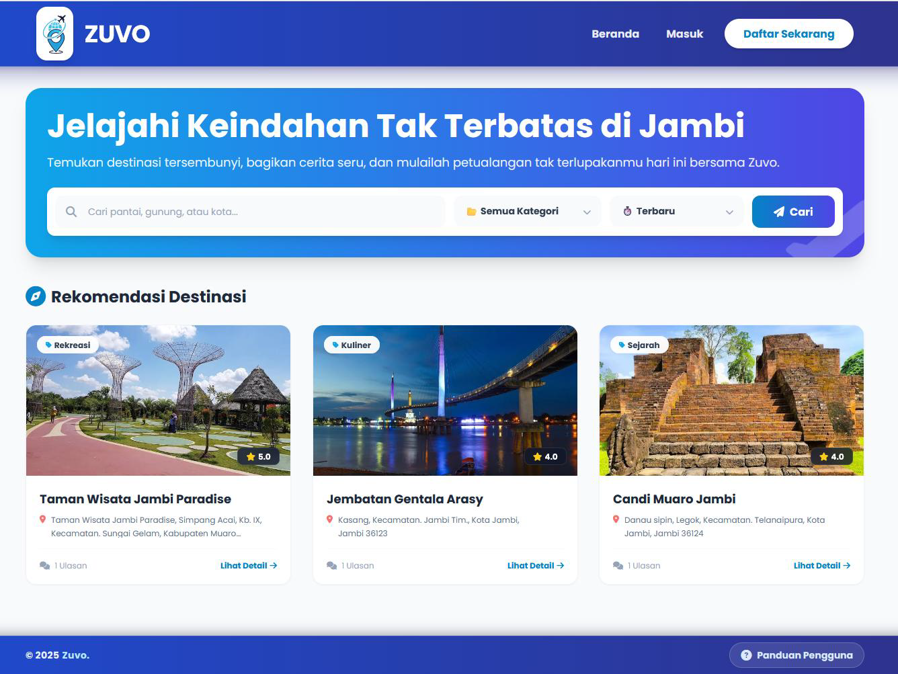

# ZUVO - Jelajahi Keindahan Jambi

Final Project Mata Kuliah Rekayasa Perangkat Lunak
# Identitas Proyek
Dokumen ini merupakan bagian dari kelengkapan tugas akhir semester untuk mata kuliah Rekayasa Perangkat Lunak.

Mata Kuliah     : Rekayasa Perangkat Lunak
Dosen Pengampu  : Dila Nurlaila, M.Kom
Kampus          : Universitas Islam Negeri Sultan Thaha Saifuddin Jambi
Kelompok        : 8
Anggota Tim
Neni Andriana    - 701230007
Meri Andriani    - 701230062
Eka Purnama      - 701230069
Tri Sulistiawati - 701230039

# Deskripsi Sistem
ZUVO adalah aplikasi berbasis web (Single Page Application) yang dirancang untuk digitalisasi informasi pariwisata di daerah Jambi. Sistem ini memfasilitasi interaksi antara wisatawan dan pengelola destinasi lokal.

# Tujuan Pengembangan/Permasalahan yang di selesaikan
Promosi Digital: Meningkatkan visibilitas destinasi wisata lokal yang belum banyak diketahui (hidden gems).
Sentralisasi Informasi: Menyediakan database terpusat untuk lokasi, harga, dan fasilitas wisata yang terverifikasi.
Pemberdayaan UMKM: Memberikan platform bagi pengelola wisata lokal untuk mengelola aset digital mereka.

# Spesifikasi Teknis
Aplikasi dibangun menggunakan arsitektur client-side modern dengan detail teknologi sebagai berikut:

Frontend      : HTML5, JavaScript (ES6 Modules).
Styling       : Tailwind CSS (CDN).
Backend as a Service (BaaS): Google Firebase.
Authentication: Manajemen sesi pengguna (User, Manager, Admin).
Firestore     : Database NoSQL real-time.
Integrasi Pihak Ketiga: FontAwesome 6 (Ikon).
Google Maps Embed API (Peta Lokasi).

# Petunjuk Instalasi & Penggunaan
Aplikasi ini menggunakan modul JavaScript modern yang memerlukan protokol HTTP/HTTPS untuk berjalan.
# Prasyarat
Web Browser terbaru (Chrome/Edge/Firefox).
Code Editor (VS Code direkomendasikan).
Koneksi Internet stabil (wajib, untuk memuat resource CDN & Firebase).
# Cara Konfigurasi
Pastikan file js/firebase-config.js sudah tersedia di dalam folder js.
Jika Anda menggunakan database sendiri, sesuaikan firebaseConfig di dalam file tersebut dengan kredensial project Firebase Anda.
# Cara Menjalankan (Run Project)
1. Buka folder proyek menggunakan VS Code.
2. Install ekstensi Live Server (jika belum ada).
3. Buka file index.html.
4. Klik kanan pada editor dan pilih "Open with Live Server".
Aplikasi akan berjalan otomatis di browser (biasanya di http://127.0.0.1:5500).

# Akun Demo
Gunakan kredensial berikut untuk menguji fitur berdasarkan hak akses:
1. Administrator
email    : neni@gmail.com
Password : Neni12345-
Hak Akses: Validasi akun pengelola, manajemen data master, hapus konten ilegal.
2. Manager (Pengelola Wisata)
email    : meri@gmail.com
Password : Meri12345-
Hak Akses: Manajemen profil wisata, update informasi lokasi, merespon ulasan.
3. Manager (Pengelola Wisata)
email    : eka@gmail.com
Password : Eka12345-
Hak Akses: Manajemen profil wisata, update informasi lokasi, merespon ulasan.
4. Manager (Pengelola Wisata)
email    : fadhli@gmail.com
Password : Eka12345-
Hak Akses: Manajemen profil wisata, update informasi lokasi, merespon ulasan.
5. User (Pengguna Umum)
email    : tiya@gmail.com
Password : Tiya12345-
Hak Akses: Eksplorasi wisata, memberikan rating & ulasan, edit profil pribadi.

# Link Deployment / Link APK / Link Demo Video
Berikut adalah tautan untuk mengakses aplikasi secara langsung atau melihat demonstrasi penggunaan:
1. Link Website (Deployment): 
2. Link Repository Github Neni Andriana : https://github.com/neniandriana22/zuvo-website.git
2. Video Demo Aplikasi: 

# Tangkapan Layar (Screenshot)

Berikut adalah tampilan antarmuka utama aplikasi ZUVO:
Gambar 1: Talaman Beranda (Home)

# Catatan: Pengguna baru dapat mendaftar melalui menu registrasi. Akun dengan role Manager memerlukan persetujuan Admin sebelum dapat beroperasi.

# Catatan Rilis & Batasan Sistem
Berikut adalah beberapa hal penting yang perlu diketahui pada versi ini (v1.0):
1. Manajemen Media Gambar
Penyimpanan gambar menggunakan metode encoding Base64 yang disimpan langsung pada dokumen Firestore.
2. Implikasi: Ukuran file upload dibatasi (disarankan < 500KB) untuk menjaga performa database.
3. Layanan Peta
Sistem menggunakan Google Maps Embed API dengan input koordinat statis (Latitude/Longitude).
4. Fitur drag-and-drop pin lokasi belum tersedia pada versi ini.
5. Alur Validasi Akun
Akun Manager yang baru mendaftar berstatus Pending secara default. Validasi manual oleh Admin diperlukan melalui Dashboard Admin untuk mengaktifkan akun.

Dokumen ini terakhir diperbarui: 2025